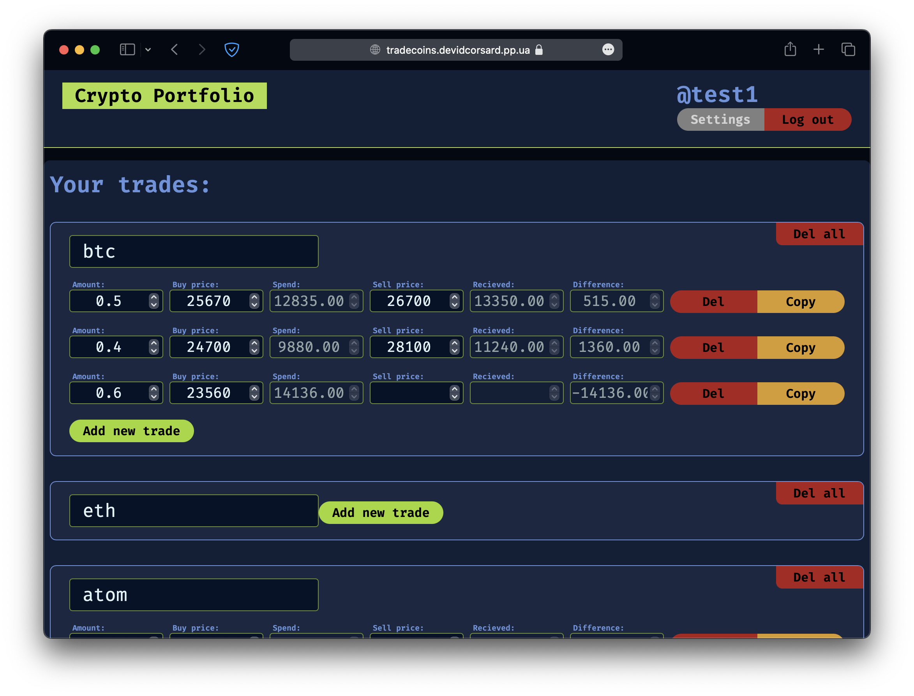
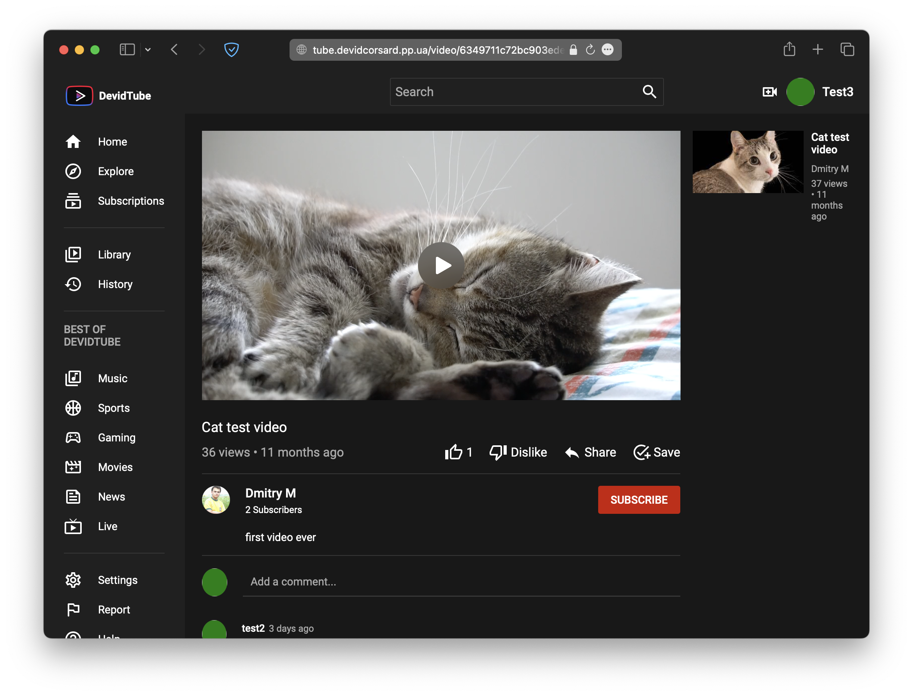
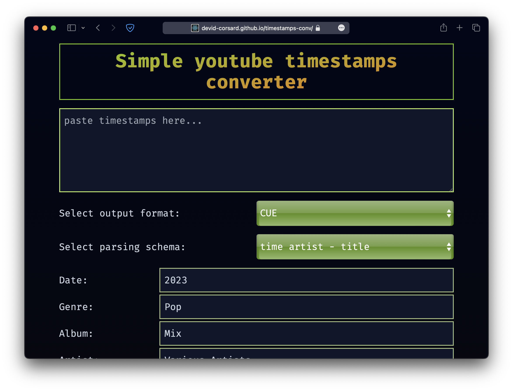
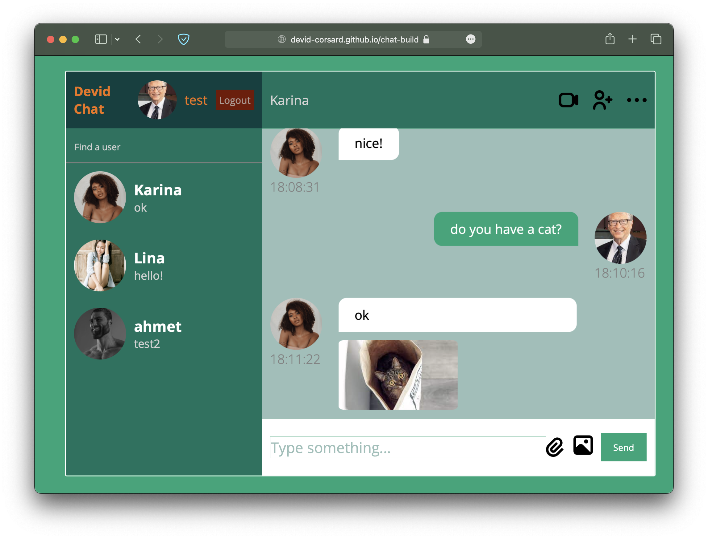
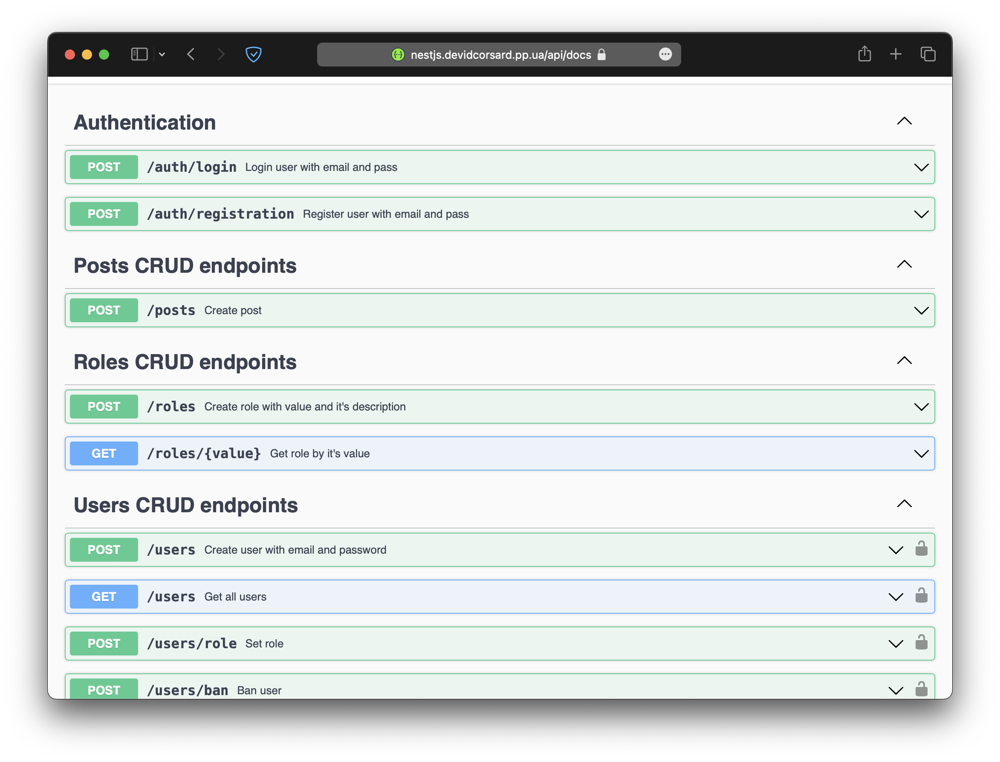
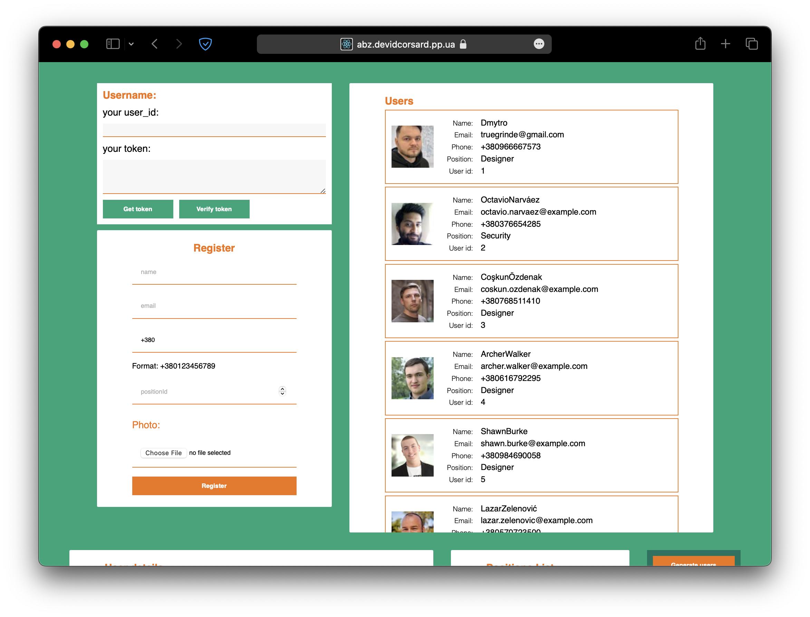

### About me
Always was interested in programming, started to learn a web-development in my free time as a hobby.

From 2022 started my way as a backend developer.

7+ years (2014–2022) worked as a [game environment artist](https://www.artstation.com/cgdima) from an idea, reference search and scheduling work to final assets in the game.

I enjoy learning new things and taking on new challenges, and I believe my experience 
in both creative and technical roles gives me a strong foundation in problem-solving 
and teamwork that allows me to approach problems innovatively.

`💻Languages: TypeScript, Rust`
`⚙️Frameworks: Node.js, Express, Nest.js, React, Actix, Tokio, Swagger`
`📀Databases: PostgreSQL, Mongo, AWS`
`🛠️Tools: Photoshop, Nginx, Git, Docker, GitHub Actions, CICD`
`🌍Speak: Ukrainian, English B2 Upper intermidiate`
`📖Education: <<Design engineer>> National Technical University of Ukraine «Kyiv Polytechnic Institute» 2014`

### Work experience:

|Company    | Position                  |Period | Responsiblies |
|-----------|---------------------------|-------|---------------|
|Spendbase | Node.js backend developer | 2023  | REST API development with Nest.JS|
|Abz.agency | Node.js backend developer | 2022-2023  | REST API development with Nest.JS|

### Previous experience, as a 3d-artist:
|Projects       |Period         |
|---------------|---------------|
|Call of Duty  	|2021 — 2022 	|
|Halo: Infinite |2019 — 2021    |
|World of Tanks |2015 — 2019	|
|Cloud Farm  	|2014 — 2015    |

### Personal web projects:
| [Trading portfolio](https://tradecoins.devidcorsard.pp.ua) | [Youtube clone](https://tube.devidcorsard.pp.ua) | [Timestamps converter to cue and ffmetadata](https://devid-corsard.github.io/timestamps-conv/) |
|------------------------------------------------------------|--------------------------------------------------|------------------------------------------------------------------------------------------------|
|  |  | 
| [Repository](https://github.com/devid-corsard/tradecoins) | [Repository](https://github.com/devid-corsard/videoapp) | [Repository](https://github.com/devid-corsard/timestamps-conv)
 
| [Chat app](https://devid-corsard.github.io/chat-build) | [Swagger documented Nest.js server](https://nestjs.devidcorsard.pp.ua) | [Abz test assignment](https://abz.devidcorsard.pp.ua) |
|--------------------------------------------------------|----------------------------------------------------------------------|-------------------------------------------------------|
|  |  |  |
| [Repository](https://github.com/devid-corsard/chat) | [Repository](https://github.com/devid-corsard/nest-server) | [Repository](https://github.com/devid-corsard/test) |

